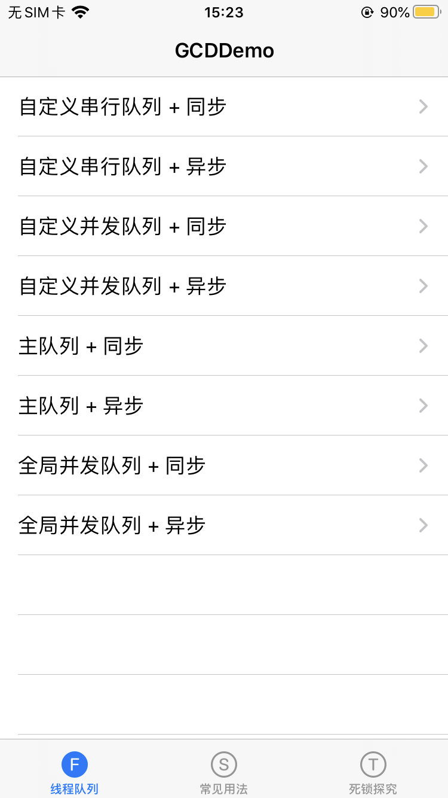
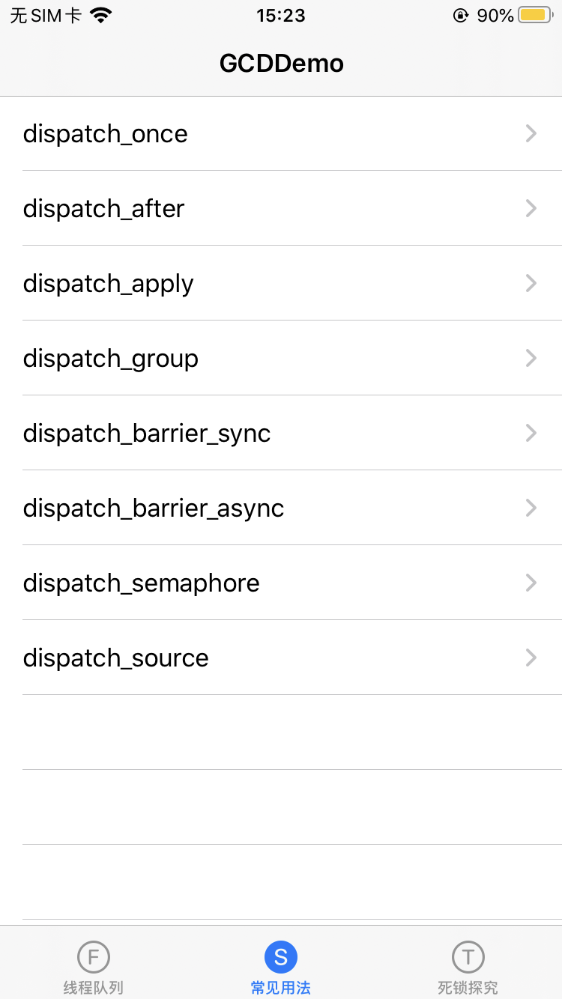
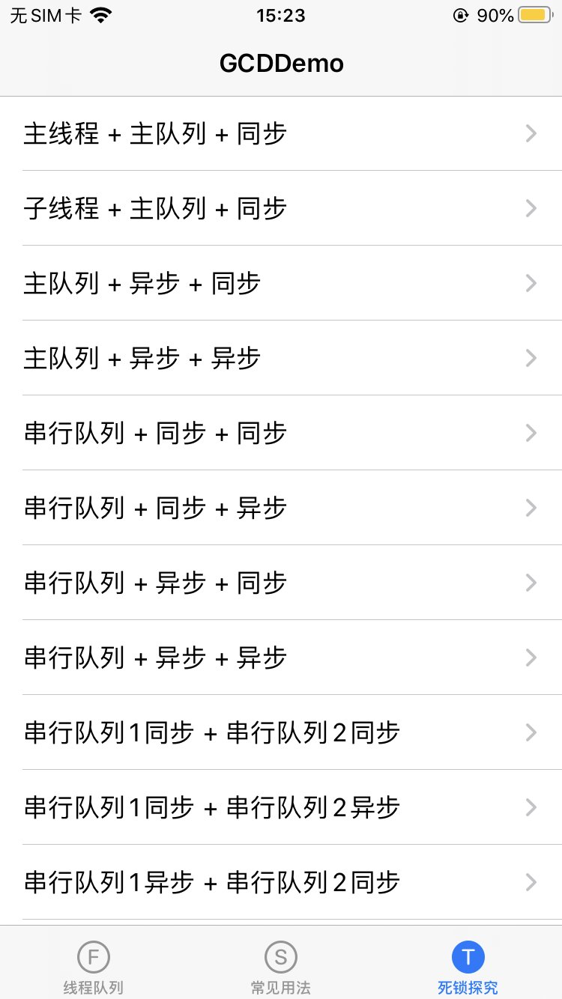

# GCDDemo
demo分三个部分，`线程队列`、`常见用法`、`死锁探究`

Xcode控制台可以查看具体的log输出

基于Objective-C，iOS 9.0

## 🚜线程队列

|             |      自定义串行队列       |       自定义并发队列       |           主队列           |        全局并发队列        |
| :---------: | :-----------------------: | :------------------------: | :------------------------: | :------------------------: |
| 同步(sync)  | 串行执行  不开辟新线程 | 串行执行  不开辟新线程 |        可能发生死锁        | 串行执行  不开辟新线程 |
| 异步(async) |  串行执行 开辟新线程  |  并发执行  开辟新线程  | 串行执行  不开辟新线程 |  并发执行  开辟新线程  |

📢注意，`主队列 + 同步`，主线程执行此任务会发生`死锁`，子线程则不会

## 🚖常见用法

常见的几个API，可能需要根据不同的业务需求灵活变通

## 🚃死锁探究

不同的情况，发生的死锁的`标红`

- 主线程 + 主队列 + 同步
- 子线程 + 主队列 + 同步
- 主队列 + 异步 + 同步
- 主队列 + 异步 + 异步
- 串行队列 + 同步 + 同步
- 串行队列 + 同步 + 异步
- 串行队列 + 异步 + 同步
- 串行队列 + 异步 + 异步
- 串行队列1同步 + 串行队列2同步
- 串行队列1同步 + 串行队列2异步
- 串行队列1异步 + 串行队列2同步
- 串行队列1异步 + 串行队列2异步
- 并发队列 + 同步 + 同步
- 并发队列 + 同步 + 异步
- 并发队列 + 异步 + 同步
- 并发队列 + 异步 + 异步

总结：使用同步函数(sync)往`当前串行`队列添加任务，会产生死锁

## License

MIT

